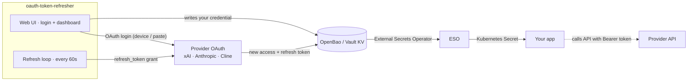
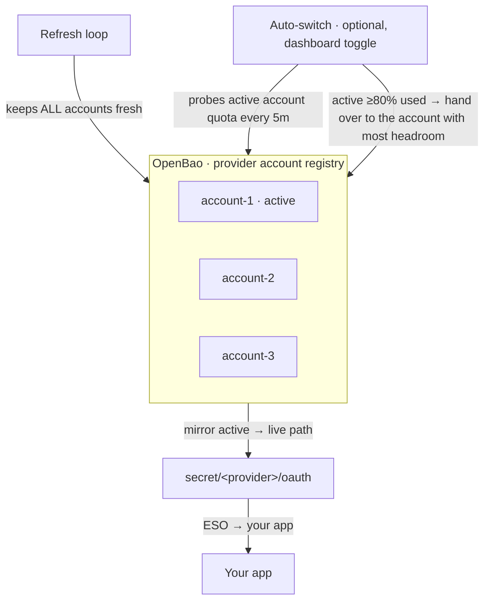

# oauth-token-refresher

Keep your **LLM subscription OAuth tokens** (xAI SuperGrok, Anthropic Claude
Pro/Max, Cline ClinePass) logged in and fresh — automatically.

- **Logs you in** — a small web UI runs each provider's OAuth flow end-to-end;
  no manual token copying.
- **Keeps you logged in** — re-mints the access token before it expires and
  stores it in **OpenBao** (or HashiCorp Vault), forever.
- **Switches accounts for you** — hold several subscriptions per provider and
  let it hand the active role to the account with the most headroom before one
  runs out (or pin one manually).



The refresher writes **only** to OpenBao — it never patches Kubernetes Secrets
directly. Anything that can read a KV path can consume the token (the
[External Secrets Operator](https://external-secrets.io/) is the usual bridge).

## Quick start

```bash
docker build -t oauth-token-refresher .
docker run -d --name oauth-token-refresher \
  -e OPENBAO_ADDR=http://your-vault:8200 \
  -e OPENBAO_TOKEN=s.your-token \
  -e ANTHROPIC_ENABLED=true \
  -p 8080:8080 \
  oauth-token-refresher
```

Open <http://localhost:8080> and click **Log in**.

## Logging in

| Provider | Flow | You |
|---|---|---|
| xAI | Device authorization | Click **Log in**, open the link, confirm the code, approve. |
| Anthropic | Code + PKCE (paste) | Click **Log in**, approve, paste the returned code into the form. |
| Cline (ClinePass) | Device authorization (WorkOS) | Click **Log in**, open the link, confirm the code, approve. |

The refresh loop keeps every credential alive from then on.

> **Security — gate the UI.** The login UI mints provider tokens. Keep `/`,
> `/login/*`, `/session/*` **LAN-only and behind SSO**. `/healthz`, `/readyz`,
> `/status`, `/metrics` are safe in-cluster. Disable the UI with
> `LOGIN_UI_ENABLED=false`.

## Multiple accounts & auto-switch

A provider can hold several accounts; exactly one is **active**, and its
credential is mirrored to the provider's live KV path — the one your apps read.



From the dashboard you can:

- **Switch to** — make any account active right now (no re-login).
- **Enable / Disable auto-switch** — persist the preference in OpenBao; it
  survives restarts and wins over the `AUTOSWITCH_PROVIDERS` default.
- **Re-login** — re-run the OAuth flow for an existing account.
- **Remove** — delete an account (removing the active one promotes the next).

Auto-switch reads the same rate-limit signal as the dashboard (Anthropic 5h/7d
windows, xAI subscription quota), takes the **worst** window as "how used" an
account is, and only hands over when a candidate is meaningfully less used
(15-point margin) — so accounts don't flap. It probes lazily (one real API
call per pass when nothing to do) and never treats a failed probe as "free".

## Configuration

All config is env-based — no config files.

| Variable | Default | Description |
|---|---|---|
| `OPENBAO_ADDR` | `http://localhost:8200` | OpenBao / Vault API URL |
| `OPENBAO_TOKEN` | *(required)* | Token with R/W on the KV paths |
| `REFRESH_SKEW` | `10m` | Re-mint if expiry ≤ now + skew |
| `LOOP_INTERVAL` | `60s` | Check interval |
| `ONCE` | `false` | Run a single cycle and exit (CronJob mode) |
| `LISTEN_ADDR` | `:8080` | Health / metrics HTTP listener |
| `LOGIN_UI_ENABLED` | `true` | Serve the login web UI |

### Auto-switch

| Variable | Default | Description |
|---|---|---|
| `AUTOSWITCH_PROVIDERS` | *(empty = off)* | Default providers to manage (dashboard toggle overrides) |
| `AUTOSWITCH_INTERVAL` | `5m` | Evaluation interval (one API probe per provider per pass) |
| `AUTOSWITCH_TRIGGER_PCT` | `80` | Switch once the active account is this used |
| `AUTOSWITCH_MARGIN_PCT` | `15` | Candidate must be this much less used to be worth taking |
| `AUTOSWITCH_COOLDOWN` | `15m` | Minimum time between switches |

### Providers

| Variable | Default | Description |
|---|---|---|
| `XAI_ENABLED` | `true` | Manage the xAI credential |
| `XAI_KV_PATH` | `secret/xai/oauth` | KV v2 path |
| `XAI_BASE_URL` | `https://api.x.ai/v1` | Written to KV as `base_url` |
| `XAI_ISSUER` | `https://auth.x.ai` | OIDC issuer for token-endpoint discovery |
| `XAI_CLIENT_ID` | `b1a00492-…` | SuperGrok OAuth client ID |
| `XAI_SCOPE` | `openid profile email offline_access grok-cli:access api:access` | OAuth scope at device login |
| `ANTHROPIC_ENABLED` | `false` | Manage the Anthropic credential |
| `ANTHROPIC_KV_PATH` | `secret/anthropic/oauth` | KV v2 path |
| `ANTHROPIC_BASE_URL` | `https://api.anthropic.com` | Written to KV as `base_url` |
| `ANTHROPIC_CLIENT_ID` | `9d1c250a-…` | Claude Pro/Max OAuth client ID |
| `ANTHROPIC_TOKEN_URL` | `https://api.anthropic.com/v1/oauth/token` | OAuth token endpoint |
| `ANTHROPIC_REDIRECT_URI` | `http://localhost:54545/callback` | Registered redirect URI (paste login) |

> Legacy `OPENBAO_KV_PATH` / `BASE_URL` are honored as aliases for xAI.

## Consuming the token

Your consumer reads the live KV path (e.g. `secret/anthropic/oauth`) and uses
`access` as a Bearer token. With ESO:

```yaml
apiVersion: external-secrets.io/v1
kind: ExternalSecret
metadata:
  name: my-app-llm
spec:
  refreshInterval: 1m
  secretStoreRef: { name: openbao, kind: ClusterSecretStore }
  target:
    name: my-app-llm
    creationPolicy: Owner
    template:
      data:
        LLM_API_KEY: "{{ .access }}"
        LLM_BASE_URL: "{{ .base_url }}"
  data:
    - secretKey: access
      remoteRef: { key: anthropic/oauth, property: access }   # or xai/oauth
    - secretKey: base_url
      remoteRef: { key: anthropic/oauth, property: base_url }
```

- **Anthropic**: `Authorization: Bearer <access>` **plus** the header
  `anthropic-beta: oauth-2025-04-20` — it is the native Anthropic API, not an
  OpenAI-compatible `/v1` endpoint.
- **Cline**: the token is a WorkOS JWT stored as `workos:<jwt>`; send it
  verbatim as the Bearer token. It rotates ~hourly — read it per-request, don't
  pin it at process start.
- **xAI**: `Authorization: Bearer <access>` against `XAI_BASE_URL`.

## Endpoints

| Endpoint | Purpose |
|---|---|
| `GET /healthz` | Liveness (always 200) |
| `GET /readyz` | Readiness (503 until providers clear their first cycle) |
| `GET /status` | JSON per-provider health |
| `GET /metrics` | Prometheus metrics |
| `GET /autoswitch/{provider}` | Auto-switch state: `{"enabled":…,"decided":…}` |
| `POST /autoswitch/{provider}/on` · `/off` | Set auto-switch for the provider |

## Manual seeding (optional)

Prefer the web UI, but you can seed a credential by hand:

```bash
bao kv put secret/anthropic/oauth \
  access="$ACCESS_TOKEN" refresh="$REFRESH_TOKEN" \
  expires="$EXPIRES_MS" base_url="https://api.anthropic.com"
```

`expires` is unix **milliseconds**. If a refresh token is revoked, re-login and
re-seed — no config changes needed.

## For developers

Building, testing, architecture, and how to add a provider: see
[CONTRIBUTING.md](CONTRIBUTING.md).

## License

MIT — see [LICENSE](LICENSE)
