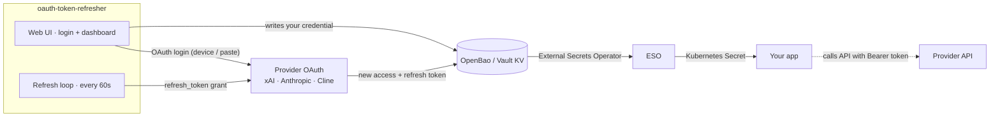
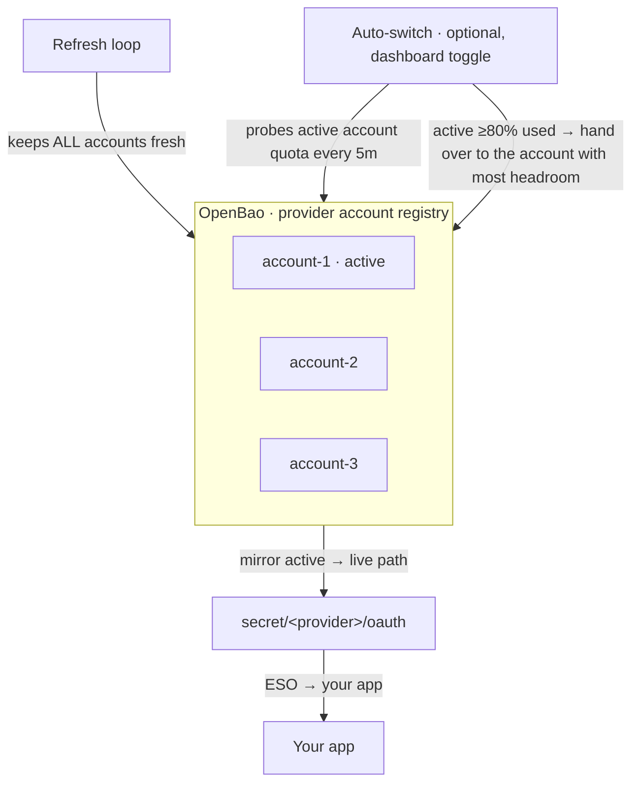

# oauth-token-refresher

Keep your **LLM subscription OAuth tokens** (xAI SuperGrok, Anthropic Claude
Pro/Max, Cline ClinePass) **fresh and always valid** — without ever touching
the provider's web page again.

It does two things:

1. **Logs you in** — a small web UI runs each provider's OAuth flow end-to-end
   and stores the credential for you (no manual token copying).
2. **Keeps you logged in** — a background loop re-mints the access token
   before it expires, forever, and hands it to whatever apps consume it via a
   secrets manager (OpenBao or HashiCorp Vault).

If your apps use [External Secrets Operator](https://external-secrets.io/)
(or any Vault KV consumer), the refreshed token flows to them automatically.



The refresher writes **only** to OpenBao — it never patches Kubernetes Secrets
directly. Anything that can read a KV path can consume the token.

## How it works

Every `LOOP_INTERVAL` (default 60s), for each provider:

1. Read `{access, refresh, expires}` from its KV path.
2. If the access token expires within `REFRESH_SKEW` (default 10m), exchange
   the refresh token for a new pair:
   - **xAI** — OIDC discovery + form-encoded `refresh_token` grant.
   - **Anthropic** — JSON `refresh_token` grant at
     `https://api.anthropic.com/v1/oauth/token` with the
     `anthropic-beta: oauth-2025-04-20` header.
   - **Cline (ClinePass)** — form-encoded grant via WorkOS. The response has
     no `expires_in`, so expiry is read from the JWT `exp` claim (~1h). The
     access token is stored wire-prefixed (`workos:<jwt>`) for `api.cline.bot`.
3. Write the new pair back to OpenBao.
4. Your consumer (ESO etc.) picks it up on its next sync.

Tokens are written with a 5-minute client skew so consumers almost never see a
near-dead token. Each cycle is recorded per provider and exposed at `/metrics`
and `/status`.

## Quick start

```bash
docker build -t oauth-token-refresher .
docker run -d --name oauth-token-refresher \
  -e OPENBAO_ADDR=http://your-vault:8200 \
  -e OPENBAO_TOKEN=s.your-token \
  -e ANTHROPIC_ENABLED=true \
  -p 8080:8080 \
  oauth-token-refresher
```

Then open <http://localhost:8080> and log in — see below.

## Self-service login (web UI)

Open the service in a browser and click **Log in**. The UI runs the full OAuth
flow and writes the credential to OpenBao; the refresh loop keeps it alive
from then on. No manual seeding required.

| Provider | Login flow | What you do |
|---|---|---|
| xAI | Device authorization | Click **Log in**, open the shown verification link, confirm the `user_code`, approve. The page completes automatically. |
| Anthropic | Authorization code + PKCE | Click **Log in**, open the authorize link, approve, then paste the returned code back into the form. |
| Cline (ClinePass) | Device authorization (via WorkOS) | Click **Log in**, open the shown verification link, confirm the `user_code`, approve. The page completes automatically. |

> **Security — gate this.** The login UI mints provider tokens and writes
> them to OpenBao. Expose `/`, `/login/*`, and `/session/*` **LAN-only and
> behind SSO** (e.g. oauth2-proxy). Leave `/healthz`, `/readyz`, `/status`,
> `/metrics` reachable in-cluster — Kubernetes probes and Prometheus scrape
> the pod directly, so gating the UI does not break monitoring. Disable the
> UI entirely with `LOGIN_UI_ENABLED=false`. Run single-replica (login
> sessions are in memory).

## Multiple accounts & auto-switch

A provider can hold several accounts at once (e.g. three different Anthropic
subscriptions). Exactly one is **active** — its credential is mirrored to the
provider's live KV path, which is what your apps read.



From the dashboard you can:

- **Switch to** — make any account the active one right now (no re-login).
- **Enable / Disable auto-switch** — let the refresher hand the active role
  to the account with the most headroom before the current one runs out.
  The preference is stored in OpenBao (survives restarts, no deployment
  change), and always wins over the `AUTOSWITCH_PROVIDERS` default.
- **Re-login** — re-run the OAuth flow for an existing account.
- **Remove** — delete an account (removing the active one promotes the first
  remaining).

### How the auto-switch decision works

It reads the same rate-limit signal the dashboard shows — Anthropic's 5h and
7d subscription windows, and the xAI subscription quota — and takes the
**highest** of them as "how used" an account is. An account with a nearly
spent 7d budget is not mistaken for a fresh one because its 5h window happens
to be empty.

Design notes worth knowing before tuning it:

- **Probing is lazy.** Only the active account is probed each pass; the
  others are probed only once the active one crosses the trigger. Every probe
  is a real (1-token) API call, so a "nothing to do" pass costs exactly one
  call.
- **Trigger well below the ceiling.** A switch is a write to OpenBao;
  consumers only see it once their secret sync picks it up. Switching at 99%
  hands over an account that is already failing requests.
- **An unreadable account is never treated as a free one.** A failed probe
  excludes that account from candidacy, and a failed probe on the *active*
  account is not read as "spent" — neither direction may be inferred from a
  missing measurement.
- **When nothing has headroom** the active account is left alone and
  `oauth_refresh_accounts_exhausted` goes to 1 (with a warning log). No amount
  of switching fixes an exhausted set; that state is for a human.

Metrics: `oauth_refresh_autoswitch_total`, `oauth_refresh_accounts_exhausted`,
`oauth_refresh_active_account_util_percent` (all labelled by `provider`).

## Providers

| Provider | Enable | KV path (default) | base_url (default) |
|---|---|---|---|
| xAI SuperGrok | `XAI_ENABLED=true` *(default on)* | `secret/xai/oauth` | `https://api.x.ai/v1` |
| Anthropic (Claude Pro/Max) | `ANTHROPIC_ENABLED=true` *(opt-in)* | `secret/anthropic/oauth` | `https://api.anthropic.com` |
| Cline (ClinePass) | `CLINE_ENABLED=true` *(opt-in)* | `secret/cline/oauth` | `https://api.cline.bot/api/v1` |

> **Anthropic consumption note:** the access token is a **Bearer** token for
> the **native** Anthropic API tied to a Claude Pro/Max subscription — not an
> API key. Your consumer must send `Authorization: Bearer <access>` **and** the
> header `anthropic-beta: oauth-2025-04-20`. It is not an OpenAI-compatible
> `/v1` endpoint.

> **Cline consumption note:** the access token is a **WorkOS JWT** stored
> wire-prefixed as `workos:<jwt>`. The `api.cline.bot` OpenAI-compatible
> gateway accepts it as `Authorization: Bearer workos:<jwt>` (the prefix
> distinguishes it from an `sk_` API key). It rotates ~hourly, so consumers
> should read it per-request (e.g. a mounted file/callback) rather than
> pinning it at process start. Subscription-covered `cline-pass/<model>` ids
> bill at cost 0.

> **Dashboard usage bars — where the numbers come from.** For Anthropic they
> are the `anthropic-ratelimit-unified-*` utilization headers. For xAI the
> dashboard reads the **subscription quota** ("Weekly SuperGrok Heavy Limit")
> from the same gRPC-Web call the grok.com Usage panel uses,
> `grok_api_v2.GrokBuildBilling/GetGrokCreditsConfig`, which accepts the OAuth
> access token this service already holds and costs no tokens. That call is an
> internal endpoint of the grok.com web app, **not a documented API** — if it
> changes, the probe falls back to a 1-token completion against
> `/v1/chat/completions` and shows the `x-ratelimit-*` window counters instead.
> Both probes run per dashboard load, per account; they are skipped entirely
> for expired tokens.

## Seed OpenBao manually (optional)

Prefer the [web UI](#self-service-login-web-ui). To seed by hand instead — or
to script it — put the credential from an OAuth login into the KV path:

```bash
bao kv put secret/anthropic/oauth \
  access="$ACCESS_TOKEN" refresh="$REFRESH_TOKEN" \
  expires="$EXPIRES_MS" base_url="https://api.anthropic.com"
```

- `expires`: unix **milliseconds** (number)
- `base_url`: the API endpoint your consumer will call
- If a refresh token is ever revoked, re-login and re-seed — no config changes
  needed

### OpenBao / Vault policy

```hcl
path "secret/data/xai/*"          { capabilities = ["create", "read", "update"] }
path "secret/metadata/xai/*"      { capabilities = ["read", "list", "delete"] }
path "secret/data/anthropic/*"    { capabilities = ["create", "read", "update"] }
path "secret/metadata/anthropic/*"{ capabilities = ["read", "list", "delete"] }
```

Create a periodic service token so it never expires (renew separately):

```bash
bao token create -policy=oauth-refresh -period=768h -orphan
```

## Configuration

All config is env-based — no config files.

### Shared

| Variable | Default | Description |
|---|---|---|
| `OPENBAO_ADDR` | `http://localhost:8200` | OpenBao / Vault API URL |
| `OPENBAO_TOKEN` | *(required)* | Token with R/W on the KV paths |
| `REFRESH_SKEW` | `10m` | Re-mint if expiry ≤ now + skew |
| `LOOP_INTERVAL` | `60s` | Check interval |
| `ONCE` | `false` | Run a single cycle and exit (CronJob mode; exits non-zero on failure) |
| `LISTEN_ADDR` | `:8080` | Health / metrics HTTP listener |
| `LOGIN_UI_ENABLED` | `true` | Serve the self-service login web UI (gate it — see above) |

### Automatic account switching

| Variable | Default | Description |
|---|---|---|
| `AUTOSWITCH_PROVIDERS` | *(empty = off)* | Comma-separated default providers to manage, e.g. `anthropic` (overridden by the dashboard toggle) |
| `AUTOSWITCH_INTERVAL` | `5m` | How often to evaluate. Each pass costs one API probe per managed provider |
| `AUTOSWITCH_TRIGGER_PCT` | `80` | Consider switching once the active account is this used |
| `AUTOSWITCH_MARGIN_PCT` | `15` | A candidate must be at least this much less used to be worth taking |
| `AUTOSWITCH_COOLDOWN` | `15m` | Minimum time between switches for one provider |

### xAI provider

| Variable | Default | Description |
|---|---|---|
| `XAI_ENABLED` | `true` | Manage the xAI credential |
| `XAI_KV_PATH` | `secret/xai/oauth` | KV v2 path (falls back to legacy `OPENBAO_KV_PATH`) |
| `XAI_BASE_URL` | `https://api.x.ai/v1` | Written to KV as `base_url` (falls back to legacy `BASE_URL`) |
| `XAI_ISSUER` | `https://auth.x.ai` | OIDC issuer for token-endpoint discovery |
| `XAI_CLIENT_ID` | `b1a00492-…` | SuperGrok OAuth client ID |
| `XAI_SCOPE` | `openid profile email offline_access grok-cli:access api:access` | OAuth scope requested at device login |

### Anthropic provider

| Variable | Default | Description |
|---|---|---|
| `ANTHROPIC_ENABLED` | `false` | Manage the Anthropic credential |
| `ANTHROPIC_KV_PATH` | `secret/anthropic/oauth` | KV v2 path |
| `ANTHROPIC_BASE_URL` | `https://api.anthropic.com` | Written to KV as `base_url` |
| `ANTHROPIC_CLIENT_ID` | `9d1c250a-…` | Claude Pro/Max OAuth client ID |
| `ANTHROPIC_TOKEN_URL` | `https://api.anthropic.com/v1/oauth/token` | OAuth token endpoint |
| `ANTHROPIC_REDIRECT_URI` | `http://localhost:54545/callback` | Registered redirect URI sent during paste login |

> Legacy `OPENBAO_KV_PATH` and `BASE_URL` are still honored as aliases for the
> xAI provider, so existing deployments keep working without changes.

## Health & metrics endpoints

| Endpoint | Purpose |
|---|---|
| `GET /healthz` | Liveness (always 200) |
| `GET /readyz` | Readiness (503 until every provider clears its first cycle) |
| `GET /status` | JSON: per-provider `last_ok`, `last_error`, `last_refresh`, `access_expiry`, `cycles`, `errors`, `healthy`, `token_valid` |
| `GET /metrics` | Prometheus text exposition (see below) |
| `GET /autoswitch/{provider}` | JSON auto-switch state: `{"enabled":…,"decided":…}` |
| `POST /autoswitch/{provider}/on` | Enable auto-switch for the provider |
| `POST /autoswitch/{provider}/off` | Disable auto-switch for the provider |

The `/healthz`, `/readyz`, `/status`, `/metrics`, and `/autoswitch/*` endpoints
are safe to leave open in-cluster. The login UI (`/`, `/login/*`, `/session/*`)
is sensitive — see [Self-service login](#self-service-login-web-ui).

### Prometheus metrics

All families are prefixed `oauth_refresh_` and labeled `{provider="…"}`:

| Metric | Type | Meaning |
|---|---|---|
| `oauth_refresh_cycles_total` | counter | Refresh cycles run |
| `oauth_refresh_errors_total` | counter | Cycles that errored |
| `oauth_refresh_success` | gauge | Last cycle succeeded (1) / failed (0) |
| `oauth_refresh_token_valid` | gauge | Current access token unexpired (1) / not (0) |
| `oauth_refresh_last_success_timestamp_seconds` | gauge | Unix time of last successful cycle |
| `oauth_refresh_last_refresh_timestamp_seconds` | gauge | Unix time the token was last re-minted |
| `oauth_refresh_access_expiry_timestamp_seconds` | gauge | Unix time the access token expires |
| `oauth_refresh_start_timestamp_seconds` | gauge | Process start time (unlabeled) |

Handy Grafana/PromQL expressions:

```promql
# Seconds until a provider's access token expires
oauth_refresh_access_expiry_timestamp_seconds - time()

# Alert: token expired or refresher failing for >10m
oauth_refresh_token_valid == 0
increase(oauth_refresh_errors_total[10m]) > 0
```

Scrape it with a Prometheus pod annotation (metrics share the health port):

```yaml
metadata:
  annotations:
    prometheus.io/scrape: "true"
    prometheus.io/port: "8080"
    prometheus.io/path: "/metrics"
```

…or a `ServiceMonitor` / `PodMonitor` targeting port `8080` path `/metrics`.

## KV entry shape

Stored at `secret/data/<provider>/oauth` (KV v2):

```json
{
  "access": "eyJ0eXAi...",
  "refresh": "rt-...",
  "expires": 1783578852000,
  "base_url": "https://api.anthropic.com",
  "updated_at": "2026-07-09T05:30:54Z"
}
```

## Kubernetes deployment

Run it as a single-replica Deployment that writes to OpenBao. Any Vault KV
consumer can then materialise the credential into an application Secret — for
example the [External Secrets Operator](https://external-secrets.io/):

```yaml
apiVersion: external-secrets.io/v1
kind: ExternalSecret
metadata:
  name: my-app-llm
spec:
  refreshInterval: 1m
  secretStoreRef:
    name: openbao
    kind: ClusterSecretStore
  target:
    name: my-app-llm
    creationPolicy: Owner
    template:
      data:
        LLM_API_KEY: "{{ .access }}"
        LLM_BASE_URL: "{{ .base_url }}"
  data:
    - secretKey: access
      remoteRef: { key: anthropic/oauth, property: access }   # or xai/oauth
    - secretKey: base_url
      remoteRef: { key: anthropic/oauth, property: base_url }
```

If your app needs a restart when the Secret changes, pair it with a secret
reloader, and renew the OpenBao service token periodically so it never
expires.

## Development

```bash
go test ./...
go build -o /tmp/oauth-refresh ./cmd/oauth-token-refresher
```

### Docker build

```bash
docker build -t oauth-token-refresher .
```

## License

MIT — see [LICENSE](LICENSE)
